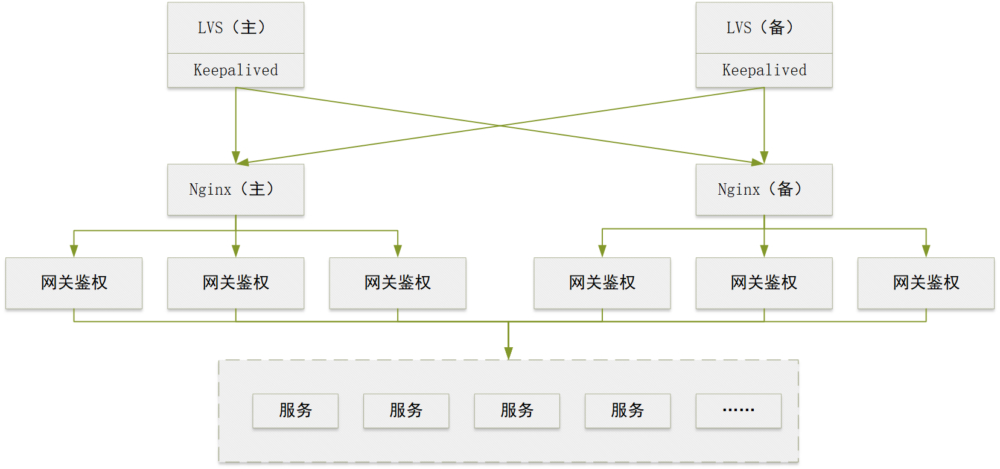

# Gateway Authentication Documentation
## Prerequisites
Based on Spring Boot 3.x, requires JDK 11 or higher.
## Purpose of Gateway Authentication

1. Unified User Login Authentication: Provides a generic user login feature, eliminating the need for individual microservices to implement separate authentication logic. It offers unified login authentication for all microservices.
2. Service Request Forwarding: All requests are routed to the gateway authentication service, which forwards them to the corresponding backend services.
3. Request Permission Control: Enforces access control on all forwarded requests based on configuration, strictly managing API access rights to prevent security vulnerabilities caused by bypassing the frontend to directly access APIs.

## 1. Quick Start

1. Deployment Architecture

   The gateway authentication software is typically deployed behind a load balancer (e.g., Nginx) to ensure high availability. The deployment architecture is shown below:
   
   
2. Software Deployment

   Difference between Cluster and Standalone versions: The `Cluster version` retains user login states after service restarts. The `Standalone version` will log out all users upon restart, requiring them to log in again.

   (1) Cluster Version Deployment (Recommended)

   ① Copy the JAR package and `config` folder from `package -> cluster` to the server.

   > **Note:** The JAR file and `config` folder must be in the same directory.

   ② Import `security_mysql.sql` from the `database` folder into your database.

   > **Note:** If using a non-`MySQL` database, please adapt the SQL script accordingly.

   ③ Update the database and `Redis` connection addresses in `application-datasource-cluster.yml`.

   > **Note:** If using a non-`MySQL` database, you must also update the `driver-class-name` driver configuration.

   ④ Update the `uri` forwarding address and `matcher` interception path in `application-gateway.yml`.

   > **Note:** More specific interception paths must be listed before broader ones (e.g., `/gateway/test/**` before `/gateway/**`), otherwise, the specific path will be ineffective.

   ⑤ Add the `spring.security.proxy-url` proxy configuration in `application-security.yml`.

   > **Note:** Prefix the proxy address with `/`. Ensure the proxy address matches the frontend proxy or Nginx server configuration.

   ⑥ Start the service using the command: `nohup java -jar spring-cloud-gateway-security-vx.x.x.jar &`

   (2) Standalone Version Deployment

   ① Copy the JAR package and `config` folder from `package -> stand-alone` to the server.

   > **Note:** The JAR file and `config` folder must be in the same directory.

   ② Copy `security_db.db` from the `database` folder to your local directory.

   > **Note:** For standalone convenience, SQLite is used by default. Other relational databases can also be used.

   ③ Update the database address in `application-datasource-standalone.yml`.

   ④ Update the `uri` forwarding address and `matcher` interception path in `application-gateway.yml`.

   > **Note:** More specific interception paths must be listed before broader ones (e.g., `/gateway/test/**` before `/gateway/**`), otherwise, the specific path will be ineffective.

   ⑤ Add the `spring.security.proxy-url` proxy configuration in `application-security.yml`.

   > **Note:** Prefix the proxy address with `/`. Ensure the proxy address matches the frontend proxy or Nginx server configuration.

   ⑥ Start the service using the command: `nohup java -jar spring-cloud-gateway-security-vx.x.x.jar &`

3. Verification

   After startup, enter the frontend address `http://localhost:8888` in your browser. If the login interface appears, the service deployment is successful.
The basic gateway authentication system is now set up. For advanced features, refer to the detailed instructions below.

4. Integration Notes

   If CSRF token functionality is enabled, you must call the "Get Token" API `http://ip:port/gateway/csrfTokenGenerator` before logging in.
   Subsequent requests must include the CSRF token in the header, with the key `X-XSRF-TOKEN`.

## 2. Gateway Integration

### 1. Login Authentication

(1) Web

   The frontend sends a `POST` request to `/login` with `Content-Type` set to `application/x-www-form-urlencoded`. The parameters for username and password are `username` and `password`.

(2) Mini Program

   The mini program sends a `POST` request to `/login/weChatLogin` with `Content-Type` set to `application/json`. The payload includes `weChatCode` and `weChatUserInfo`, structured as follows:

```json
{
  "weChatCode": "xx",
  "weChatUserInfo": {
    "nickName": "xxx",
    "gender": 0
  }
}
```

### 2. Source IP Retrieval

  Since requests are forwarded through the gateway, using `HttpServletRequest#getRemoteAddress` only returns the gateway's IP. Downstream services can retrieve the real source IP from the `XReal-IP` header by calling `HttpServletRequest#getHeader("XReal-IP")`.

  To facilitate source IP retrieval downstream, the proxy service should configure header forwarding at the routing node. For example, Nginx configuration:

```nginx
location /gatewayservice/ {
            proxy_pass http://127.0.0.1:8888/;
            proxy_http_version 1.1;
            proxy_set_header Upgrade $http_upgrade;
            proxy_set_header Connection "upgrade";

            proxy_set_header Host $host;
            proxy_set_header XReal-IP $remote_addr;
            proxy_set_header X-Forwarded-For $remote_addr;
            proxy_set_header X-Forwarded-For $proxy_add_x_forwarded_for;
        }
```

### 3. User ID Retrieval

   After a user logs in, forwarded requests will include the user ID and username in the headers. Downstream services can retrieve this data. The header key for the user ID is `userId`, and for the username, it is `username`.

### 4. Forwarding Logs

   By enabling the gateway forwarding log recording feature, all forwarded requests are logged in the `gateway_request_monitor` database table. You can directly query this table for custom logic.

### 5. Forwarding Statistics

   Enabling forwarding logs also activates forwarding statistics. Call `GET http://<IP>:<PORT>/gateway/queryRequestStatistic` to retrieve statistical data. For details, refer to `web API documentation 6. Query Forwarding Statistics`.

### 6. Login Logs

   Enabling the login log recording feature stores successful login records in the `t_log` database table. You can directly query this table for custom logic.

## 3. Configuration Guide

### 1. Gateway Interception

```yaml
spring:
  cloud:
    gateway:
      session:
        # No timeout limit for Session (effective during forwarding): -1 means unlimited. Unit: minutes
        timeout: 30
        # No limit on concurrent sessions: -1
        maxSessions: 10000
      default-filters:
        - Session
      routes:
        - id: server_route
          # Forwarding address
          uri: http://localhost:8080
          predicates:
            # Interception path
            - name: Path
              args:
                matcher: /gateway/**
          filters:
            # Skip 1 path prefix
            - name: StripPrefix
              args:
                # The key here must be "parts"
                parts: 1
            # Request size limit, default 5MB
            - name: RequestSize
              args:
                maxSize: 5000000
            # Rate limiting
            - name: RequestRateLimiter
              args:
                # Tokens generated per second
                redis-rate-limiter.replenishRate: 100
                # Maximum token capacity
                redis-rate-limiter.burstCapacity: 200
        - id: server_route2
          # Forwarding address, providerService is the key under
          # spring.cloud.discovery:client.simple.instances in "application-loadbalance.yml"
          uri: lb://providerService
          predicates:
            # Interception path
            - name: Path
              args:
                matcher: /loadbalance/**
          filters:
            # Skip 1 path prefix
            - name: StripPrefix
              args:
                # The key here must be "parts"
                parts: 1
            # Request size limit, default 5MB
            - name: RequestSize
              args:
                maxSize: 5000000
        # SockJS route must be used in conjunction with websocket route
        - id: sockJS_route
          uri: http://localhost:8080
          predicates:
            - Path=/websocket/**
        - id: websocket_route
          uri: ws://localhost:8080
          predicates:
            - Path=/websocket/**
      # Enable/Disable gateway
      enabled: true
      loadbalancer:
        use404: true
  application:
    name: gateway
```

   Interception is primarily configured under `spring.cloud.gateway.routes`.

   HTTP interception configuration is as follows:

(1) `id` should be unique.

(2) `uri` is the forwarding target address after interception; specify up to the port number.

(3) When `predicates.name` is `Path`, `args.matcher` defines the interception path, which can be multi-level (e.g., `/a/b/**`).

(4) When `filters.name` is `StripPrefix`, `args.parts` defines the number of path segments to strip after forwarding. For example, if set to `1`, `/a/b/**` becomes `/b/**`.

(5) When `filters.name` is `RequestSize`, `args.maxSize` sets the maximum payload size limit for forwarded requests.

   WebSocket interception supports both standard WebSocket and SockJS. Standard WebSocket directly intercepts connection endpoints and forwards them to `ws://` addresses. SockJS requires separate configuration for the interception URL and the forwarding HTTP address.

### 2. Super Administrator

   Configure the super administrator in the configuration file to prevent accidental deletion from the database. Set up the super administrator in `application.yml` as follows:

```yaml
login:
  user:
    # Custom super administrator ID
    id: 0
    # Username setting
    username: superadmin
    # Password setting, can be generated using the main method in com.github.zk.spring.cloud.gateway.security.util.PasswordGeneratorUtils
    password: "{bcrypt}$2a$10$0EQexC0XYw58x.ys.Ym8QO3H2Llr0G4wEAFddm8PkOUGy6hQraaui"
    # Whether the account is locked
    accountNonLocked: true
    # Role settings
    roles:
      # Custom role ID
      - id: 0
        # Custom role name
        roleName: 超级管理员
        # Permission settings
        permissionInfos:
          # Custom permission name
          - urlName: 所有权限
            # Custom permission /** represents all permissions
            url: /**
```

### 3. Session Control

   Session control automatically logs users out when the service is idle. Configure the Session timeout in `application-gateway.yml` (in minutes). A value of `-1` means no timeout. Configuration:

```yaml
spring:
  cloud:
    gateway:
      session:
        # No timeout limit for Session (effective during forwarding): -1 means unlimited. Unit: minutes
        timeout: 30
```

### 4. Concurrent Online Users Control

   Controls the maximum number of concurrently logged-in users. Re-logging in an active session does not count against this limit. Configure in `application-gateway.yml`. A value of `-1` means unlimited. Configuration:

```yaml
spring:
  cloud:
    gateway:
      session:
        # No limit on concurrent sessions: -1
        maxSessions: 10000
```

### 5. Login Logs

   Login logs record successful login events. Supports console printing and database recording. Configure in `application-gateway.yml`. By default, logging is disabled.

1. Console Output

```yaml
log:
  enabled: true
```

2. Database Recording

```properties
log:
  enabled: true
  database: true
```

### 6. Account Locking

   Locks the account after a set number of failed login attempts to prevent brute-force attacks. Default is 3 attempts. Configure failed attempt threshold and lock duration in `application-gateway.yml`. A value of `-1` disables account locking. Default lock duration is 5 minutes. Configuration requires time units. Example:

```yaml
spring:
  cloud:
    gateway:
      session:
        lockRecord: 5
        lockedTime: 1M
```

### 7. Password Encryption

   When a `POST` request includes a `password` parameter, the gateway automatically encrypts it before forwarding. Configure `- RequestBodyOperation` in `application-gateway.yml`:

```yaml
spring:
  cloud:
     gateway:
        routes:
           - id: server_route
              # Forwarding address
             uri: http://127.0.0.1:8080
             predicates:
                # Interception path
                - name: Path
                  args:
                     matcher: /gateway/**
             filters:
                - name: StripPrefix
                  args:
                     parts: 1
                - RequestBodyOperation
```

### 8. Forwarding Logs

   The gateway logs all forwarded requests. Configure the `-Monitor` filter in `application-gateway.yml`. You can apply it globally to all routes or specify it within individual route configurations. Details:

Log all requests

```yaml
spring:
  cloud:
    gateway:
      default-filters:
        - Monitor
```

Or log requests for specific routes

```yaml
spring:
  cloud:
    gateway:
      routes:
        - id: server_route
          # Forwarding address
          uri: http://127.0.0.1:8081
          predicates:
            # Interception path
            - name: Path
              args:
                matcher: /gateway/**
          filters:
            - Monitor
```

### 9. CSRF Interception

   The gateway supports CSRF protection to prevent cross-site attacks. Disable it in `application-security.yml` (enabled by default):

```yml
spring:
  secrurity:
    csrf-enable: false
```

### 10. Mini Program

   The gateway supports Mini Programs. Configuration is mainly in `application-wechat.yml`. Note that `wechat.roleIds` must match the role IDs in the database. Permissions are automatically bound upon configuration.

### 11. Load Balancing

   Load balancing distributes requests across multiple downstream service instances to reduce load. Enable it by setting `spring.profiles.active=loadbalance` in `application.yml`. Configuration for `application-loadbalance.yml`:

```yaml
spring:
  cloud:
    discovery:
      client:
        simple:
          instances:
            ## Load balancing addresses
            providerService:
              - uri: http://1.1.1.1:8080
              - uri: http://1.1.1.2:8080
    loadbalancer:
      healthCheck:
        ## Health check address, can use one of the service addresses as the health check path
        path:
          providerService: /health/healthCheck
        ## Health check initial delay
        initialDelay: 0
        ## Interval for re-running health checks
        interval: 5s
      ##
      configurations: health-check
```

(1) `uri` under `spring.cloud.discovery.client.simple.instances.providerService` defines service addresses. Configure multiple addresses for load balancing.

(2) `spring.cloud.loadbalancer.healthCheck.path.providerService` is the health check endpoint. The target service must expose a matching `GET` endpoint.

(3) Other settings can remain at their defaults.

### 12. Whitelist
Configure IP-based whitelists to restrict login IP ranges in `application-security.yml`:
```yaml
spring:
  security:
    # Whitelist authentication switch, disabled by default
    whitelist-enable: false
    # Whitelist configuration, configure IPs after enabling
    whitelist:
      ips:
        - 127.0.0.1
        - 192.168.1.100              # Single IP
        - 192.168.1.1-192.168.1.255   # Range (separated by -)
```

## 4. Important Notes

### 1. Cross-Origin Resource Sharing (CORS)

   If the frontend is not proxied by the gateway, use a proxy to resolve CORS issues. Two methods:

(1) Frontend Proxy

(2) Nginx Proxy

   After configuring the Nginx proxy, ensure the proxy path matches the example above. Pay attention to the trailing `/` in Nginx configurations:

```text
location /proxy/ {
  proxy_pass  http://127.0.0.1:8888/;
}
```

   After proxying, you must also configure the proxy path in `application-security.yml`. Adjust `/proxy` in the example to match your actual path:

```yaml
spring:
  security:
    proxy-url: "/proxy"
```

### 2. Database Dependencies

   To extend user fields, modify and expand the imported database table schema.

### 3. Static Resource Exclusion

   To exclude static resources from gateway control, configure them in `application-security.yml`:

```yaml
spring:
  security:
    antpatterns: "/js/**,/css/**"
```

### 4. WebSocket Testing

   Access `http://IP:PORT/web/websocket.html` for the testing interface. The WebSocket test URL is `ws://localhost:8888/websocket`, which is forwarded through the gateway to the target service.
   The target WebSocket service must expose a WebSocket endpoint.

### 5. Source Code Compilation

   For source code compilation:

- Standalone version: Select the `stand-alone` profile in Maven and run `package`.
- Cluster version: Select the `cluster` profile in Maven and run `package`.
