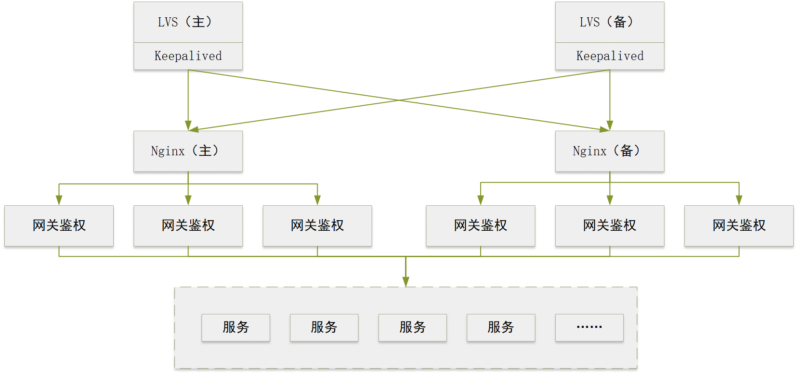

# 网关鉴权说明文档
  网关鉴权是将服务与外部请求隔离，通过网关转发请求，达到服务统一入口。在网关层进行登录认证以及接口权限控制，对各服务统一认证。 
## 版本更新说明
  v4.2.1 版本增加了锁定账户输入密码错误次数配置，并支持配置自动解锁时间。
## 快速开始
1. 部署架构

网关鉴权软件一般是在Nginx等负载软件下层，通过负载软件使网关鉴权软件达到高可用，部署架构如图所示：
   
2. 软件部署
   
   (1) package包中是编译后的部署软件，将jar包和config文件夹拷贝至服务器，注意层级保持一致。 <br>
   (2) 将database中的security.sql导入到数据库中。<br>
   (3) 修改`application-datasource.yml`中的数据库和redis连接地址。<br>
   (4) `application-gateway.yml`中添加代理配置，详见`4 注意事项 的 4.1 跨域问题`章节。<br>
   (5) 通过命令`nohup java -jar spring-cloud-gateway-security-vx.x.x.jar &`启动服务。
3. 成功验证

启动完成后，在浏览器中输入前端地址http://localhost:8888/web/dist/index.html ，出现前端登录界面，表示服务部署成功。
至此简单的网关鉴权已搭建完成，如需更多功能，请参考以下详细说明。
### 1. 功能概述
#### 1.1. 登录认证
##### 1.1.1. 原理介绍
登录认证是对用户名、密码的认证。

(1) web
用户通过浏览器登录时，服务查询数据库中是否有匹配的用户名和密码，如果匹配成功，将浏览器与服务之间的会话保存在Redis中，并返回登录成功状态。
(2) 小程序
用户通过小程序登录时，服务通过http请求小程序登录接口，如果登录成功，将小程序与服务之前会话保存在Redis中，并返回登录成功状态。
##### 1.1.2. 使用方式
(1) web

前端通过`POST`请求`/login`地址，`Content-Type`需要设置为`application/x-www-form-urlencoded`。用户名和密码的参数分别为`username`和`password`

(2) 小程序

小程序通过 `POST`请求 `/login/weChatLogin`地址，`Content-Type` 设置为 `application/json`，传参为 `weChatCode` 和 `weChatUserInfo`，结构如下：
```json
{
  "weChatCode": "xx",
  "weChatUserInfo": {
    "nickName": "xxx",
    "gender": 0
  }
}
```
#### 1.2. 超级管理员
##### 1.2.1. 原理介绍
在配置文件中进行超级管理员设置，避免在数据库中误删除超级管理员。登录时匹配如果为超级管理员用户，则不进行数据库查询，直接与配置文件中的超级管理员用户名密码及角色进行匹配。
##### 1.2.2. 使用方式
在`application.yml`配置超级管理员，配置格式如下：
```yaml
login:
  user:
    # 自定义超级管理员id
    id: 0
    # 用户名设置
    username: superadmin
    # 密码设置，可在com.github.zk.spring.cloud.gateway.security.util.PasswordGeneratorUtils类，使用main方法生成
    password: "{bcrypt}$2a$10$0EQexC0XYw58x.ys.Ym8QO3H2Llr0G4wEAFddm8PkOUGy6hQraaui"
    # 是否不锁定账户
    accountNonLocked: true
    # 角色设置
    roles:
      # 自定义id
      - id: 0
        # 自定义角色名称
        roleName: 超级管理员
        # 权限设置
        permissionInfos:
          # 自定义权限名称
          - urlName: 所有权限
            # 自定义权限 /** 表示全部权限
            url: /**
```
#### 1.3. Session控制
##### 1.3.1. 原理介绍
Session控制是在服务无请求时，自动登出服务的时间控制。在服务接收到请求时，通过过滤器截获请求，并更新Session会话时长，
并将时长设置在Redis的过期时间。
##### 1.3.2. 使用方式
在`application-gateway.yml`配置Session超时时间，单位为分钟，值为-1时表示无限时长，具体配置如下：
```yaml
spring:
  cloud:
    gateway:
      session:
        # 不限制Session过期时间（转发时生效）：-1 单位：分钟
        timeout: 30
```
#### 1.4. 同时在线用户数控制
##### 1.4.1. 原理介绍
同时在线用户数控制是对登录用户数量的限制，通过设置可取消限制。服务通过对当前登录的用户Session数量判断登录的用户数，
未退出的用户，重复登录时不受在线用户数量限制。
##### 1.4.2. 使用方式
在`application-gateway.yml`配置同时在线用户数控制，当值设置为-1时表示无限制，具体配置如下：
```yaml
spring:
  cloud:
    gateway:
      session:
        # 不限制登录人数：-1
        maxSessions: 10000
```
#### 1.5. 异地登录踢出
##### 1.5.1. 原理介绍
异地登录踢出是当前用户在一处登录，同一账号在其他地方进行登录的时候，原登录被强制登出。服务在接收登录请求时会将Session进行更新，原Session信息失效，
从而达到原登录失效的功能。
##### 1.5.2. 使用方式
软件自带功能，咱不支持配置。
#### 1.6. 登录日志
##### 1.6.1. 原理介绍
登录日志是在用户登录后，将登录信息进行记录，支持在控制台打印日志和记录到数据库中两种方式。通过配置注入不同Bean，两种Bean实现不同的方法，
从而达到两种日志记录方式。
##### 1.6.2. 使用方式
在`application-gateway.yml`配置日志记录，不配置时默认不记录登录日志，具体配置如下：
1. 控制台打印
```yaml
log:
  enabled: true
```
2. 数据库中记录
```properties
log:
  enabled: true
  database: true
```
#### 1.7. 账户锁定
##### 1.7.1. 原理介绍
用户登录系统时，输入密码错误多次后锁定账户，避免暴力破解密码，默认输入错误3次。
系统根据登录用户，在Redis中记录登录失败次数，登录失败累加计数，当失败次数超过3次后，触发锁定账户机制，
修改数据库锁定字段，并清空Redis锁定计数。锁定后会立即触发解锁计时。
##### 1.7.2. 使用方式
在`application-gateway.yml`中配置密码错误次数，当值为-1时表示不锁定账户，同时可配置解锁时间，默认锁定时间5分钟,配置时需要携带单位，具体配置如下：
```yaml
spring:
  cloud:
    gateway:
      session:
        lockRecord: 5
        lockedTime: 1M
```
#### 1.8. 密码加密
##### 1.8.1. 原理介绍
由于系统登录基于crypto加密方式进行验证，因此针对系统密码提供crypto加密。当请求使用`POST`方式时，
系统检测传参字段带有password时，自动对该字段值进行加密，然后向下游转发。系统采用网关拦截器的方式，
对请求进行拦截，当请求为`POST`时，对请求进行处理，提取`password`字段，调用加密插件进行加密后，
放回原请求并设置请求头中数据长度等字段，转发至下游服务。
##### 1.8.2. 使用方式
在`application-gateway.yml`文件中配置`- RequestBodyOperation`，可对转发的请求地址进行密码加密。
详细配置如下所示：
```yaml
spring:
  cloud:
     gateway:
        routes:
           - id: server_route
              # 转发地址
             uri: http://127.0.0.1:8080
             predicates:
                # 拦截请求路径
                - name: Path
                  args:
                     matcher: /gateway/**
             filters:
                - name: StripPrefix
                  args:
                     parts: 1
                - RequestBodyOperation
```
#### 1.9. 可视化界面
##### 1.9.1. 原理介绍
网关鉴权系统提供接口权限配置的功能界面，简化配置操作。权限分为私有、公开和匿名三种，私有是对角色进行接口权限配置，
公开是用户登录后，所有角色都具有该权限，匿名是不需要登录系统，对外开放的权限。
##### 1.9.2. 使用方式
首先需要开放前端静态文件权限，在`application-gateway.yml`文件中配置静态文件放行，静态文件相对路径在`/web/dist/`目录下，如下所示：
```yaml
spring:
  static:
    antpatterns: "/web/dist/**"
```
接口权限配置不必配置全路径，可将接口地址进行分类，按照`/**`的方式进行配置，如上配置的`/web/dist/**`表示在/web/dist/目录下的所有地址均可访问。
界面请求地址 http://<IP>:<PORT>/web/dist/index.html。IP是网关鉴权系统部署的服务器IP，PORT是网关鉴权系统中配置的端口号`server.port = 8888`。
#### 1.10. 负载均衡
##### 1.10.1. 原理介绍
网关鉴权系统可对下游服务进行负载均衡，方便服务的集群管理。引入SpringCloudLoadbalance插件
```xml
<dependency>
   <groupId>org.springframework.cloud</groupId>
   <artifactId>spring-cloud-starter-loadbalancer</artifactId>
</dependency>
```
系统根据配置的负载均衡地址进行轮询请求，当下游服务下线，自动剔除该节点，等待下游服务正常后，自动加入节点列表。
##### 1.10.2. 使用方式
1. 开启负载均衡配置文件

在`application.yml`配置文件中开启`application-liadbalance.yml`配置。如下所示
```yaml
spring:
  profiles:
    active: loadbalance
```
2. 配置负载均衡

在`application-liadbalance.yml`配置文件中配置下游服务地址，以及健康检查地址等，注意健康检查地址需要下游服务提供http接口，详细配置如下所示
```yaml
spring:
  cloud:
    discovery:
      client:
        simple:
          instances:
            ## 负载均衡地址
            providerService:
              - uri: http://1.1.1.1:8080
              - uri: http://1.1.1.2:8080
    loadbalancer:
      ## 负载均衡开关
      enabled: true
      healthCheck:
        ## 健康检查地址， 可以采用服务其中一个地址作为健康检查地址
        path:
          providerService: /health/healthCheck
        ## 健康检查初始延迟
        initialDelay: 0
        ## 重新运行健康检查周期间隔
        interval: 5s
      ##
      configurations: health-check
```   
3. 配置转发路由

在`application-gateway.yml`配置文件中配置转发路由，注意地址uri为`application-loadbalance.yml`中的实例名称，实例中实例名称为`providerService`。
详细配置如下：
```yaml
spring:
  cloud:
    gateway:
      routes:
        - id: server_route2
          # 转发地址, providerService为"application-loadbalance.yml"配置文件中
          # spring.cloud.discovery:client.simple.instances 下的key
          uri: lb://providerService
          predicates:
            # 拦截请求路径
            - name: Path
              args:
                matcher: /loadbalance/**
          filters:
            # 跳过1个前缀
            - name: StripPrefix
              args:
                # 此处 key 必须为 “parts”
                parts: 1
            #            - StripPrefix=1
            # token身份认证 JwtCheckGatewayFilterFactory
            - TokenCheck
            # 请求流量限制，默认5MB
            - name: RequestSize
              args:
                maxSize: 5000000
```
#### 1.11. 上游IP转发
##### 1.11.1. 原理介绍
上游IP转发是对网关之前的调用方IP地址转发功能，一般情况下，下游服务获取到的访问来源地址都是网关鉴权服务所在服务器的地址。
为了能够获取真实访问地址，例如浏览器所在客户端地址，网关鉴权系统将真实地址存放在请求头中，在请求头中增加了`XReal-IP`, 。
##### 1.11.2. 使用方式
下游服务获取真实来源IP，可从请求头`XReal-IP`中获取，如需获取网关IP，使用`request#getRemoteAddress`方式。
#### 1.12. 转发日志
##### 1.12.1. 原理介绍
转发日志是请求经过网关鉴权系统时，对转发的日志进行记录的功能。网关鉴权系统通过拦截器对请求地址进行转发统计并存入数据库。记录的主要内容有接口地址、接口状态、响应时长、异常描述、请求时间。
##### 1.12.2. 使用方式
在`application-gateway.yml`文件中配置拦截器，可以在路由配置外配置所有转发都经过拦截，也可以在路由配置内，配置该路由转发拦截记录，详细配置如下：
```yaml
spring:
  cloud:
    gateway:
      default-filters:
        - Monitor
```
或
```yaml
spring:
  cloud:
    gateway:
      routes:
        - id: server_route
          # 转发地址
          uri: http://127.0.0.1:8081
          predicates:
            # 拦截请求路径
            - name: Path
              args:
                matcher: /gateway/**
          filters:
            - Monitor
```
#### 1.13. 转发统计
##### 1.13.1. 原理介绍
转发统计是对网关鉴权软件转发的数据进行统计功能，从开启转发记录功能开始，根据转发地址进行统计。统计数据存储在Redis中，方便用户快速查询请求统计信息。
##### 1.13.2. 使用方式
通过web接口访问获取，详细请求方式见 `Web接口文档中，"6. 查询转发统计信息"`。
### 2. Web接口
详见`Web接口文档`，Web接口主要用于对网关鉴权系统界面的自定义开发使用，若使用本系统自带界面，则忽略此文档。
### 3. 数据库设计
详见`数据库表结构设计`。
### 4. 注意事项
#### 4.1 跨域问题
当前服务由于采用跳转方式，需要与前端同源，否则登录成功后会因无法获取用户，导致返回失败。解决方法有两种：<br>
(1) 前端代理

前端代理后，服务也需要在`application-gateway.yml`中配置代理路径，如下所示：
```yaml
spring:
  web:
    proxy:
      url: "/proxy"
```
(2) Nginx代理

Nginx代理后，也需要配置如上所示代理路径，Nginx中配置应注意末尾"/"，详细配置如下：
```text
location /proxy/ {
  proxy_pass  http://127.0.0.1:8080/;
}
```

#### 4.2 数据库表结构
用户相关的表结构（t_user、t_role、user_role）至少需要包含当前表数据，数据内容不限制。

#### 4.3 拦截配置
`application-gateway.yml` 中拦截地址范围大的写在范围小的配置之后,如/user/remove/** 应配置在/user/**之前，否则小范围限制不生效。

#### 4.4 小程序配置
小程序相关配置在 `application-wechat.yml` , 其中 roleIds 需要与数据库中的角色id对应，设置完成后自动绑定相关权限。

#### 4.5 匿名访问接口
允许匿名访问的转发配置，不能添加 -tokenCheck 配置，否则登录后无法访问接口，匿名接口登录后应依然可以访问。

#### 4.6 静态资源放行
在 `application-gateway.yml` 中配置，结构如下：

```yaml
spring:
  static:
    antpatterns: "/js/**,/css/**"
```

#### 4.7 响应code

| 序号 | code  | 描述               |
| ---: | :---: | :--------------- |
|    1 |   0   | 成功              |
|    2 | 9000  | 需要跳转到登录界面   |
|    3 | 10000 | 失败              |